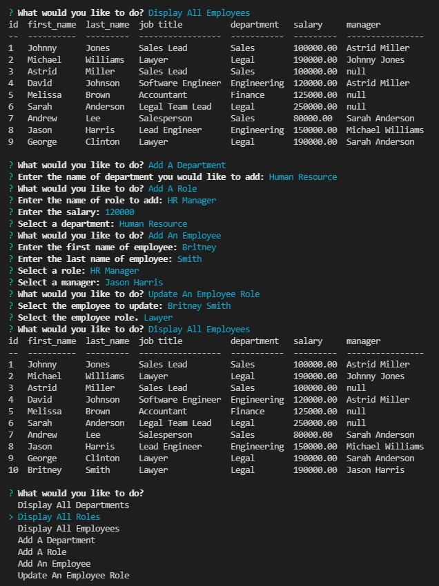

# Employee Tracker 

## Description
A command-line application that manages a company's employee database.

## Table of Contents
 * [Installation](#installation)

 * [Usage](#usage)

 * [Contributing](#contributing)

 * [Walkthrough](#walkthrough)

 * [Screenshot](#screenshot)

 * [License](#license)

 * [Links](#links)
 
 * [Questions](#questions)

## Installation
  - Clone the GitHub repository onto your local machine
  - Open the repository via command line
  - Create a .gitignore file and include node_modules/ and .DS_Store/.
  - Create your .gitignore file before npm dependencies installation.
  - npm init
  - Make sure the repository has a package.json with the dependencies required. 

## Usage
  - Use node command npm start to run the appliacation
  - Select from the menu
  - Display All Departments
  - Display All Roles
  - Display All Employees
  - Add A Department
  - Add A Role
  - Add An Employee
  - Update An Employee Role

## Walkthrough
Walk through video here - [Youtube Link](https://youtu.be/80qtOsBajLA)

## Screenshot

## Contributing 
Please read the installation section. 

## Links

- [GitHub Repository](https://github.com/chunngaimo/employeeTracker)

## License
License with MIT

## Questions
Feel free to ask any questions and contact me at wjy16888888@gmail.com. 

GitHup repo link https://github.com/chunngaimo/employeeTracker.